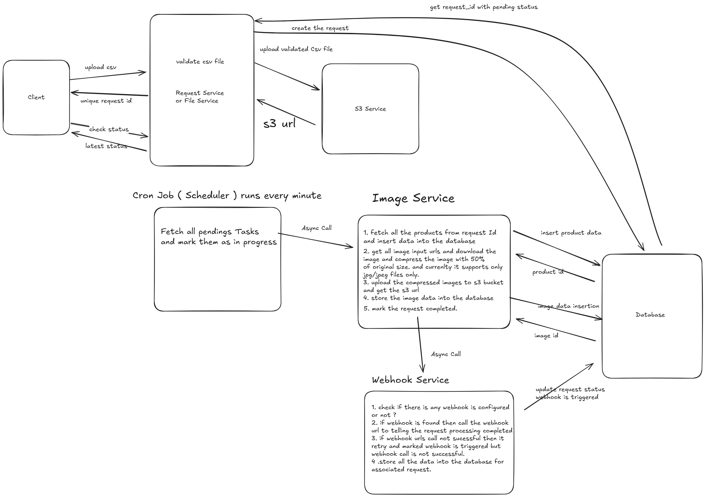
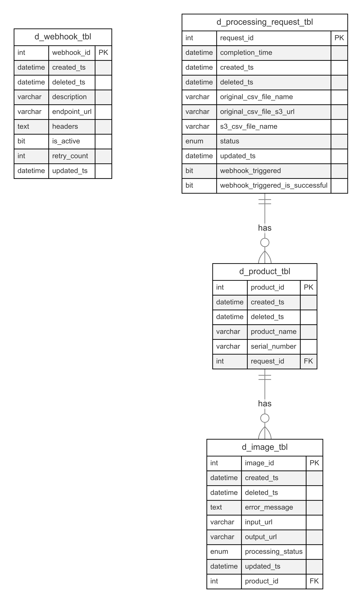

# Image Processing System Documentation

## Problem Overview

The Image Processing System efficiently processes image data from CSV files. Users can upload CSV files containing product information and image URLs. The system validates the CSV format, compresses images asynchronously, stores the processed images, and provides APIs for tracking processing status.

## Key Features

- **CSV Upload**: Users upload CSV files through an interactive UI.
- **Asynchronous Processing**: Background workers handle data processing efficiently.
- **Data Storage**: CSV files and processed images are securely stored in Amazon S3.
- **Error Handling**: Logs and alerts notify users of incorrect or malformed data.
- **API Access**: Users can track request statuses and download processed CSV files.
- **Webhook Integration**: Configurable webhooks trigger upon request completion.
- **Automated Task Scheduling**: A cron job ensures timely processing of pending requests.

## Deployed Links

UI link: [http://image-compresser.ap-south-1.elasticbeanstalk.com](http://image-compresser.ap-south-1.elasticbeanstalk.com)

Postman Link: [https://documenter.getpostman.com/view/24217970/2sAYkBt2Qe](https://documenter.getpostman.com/view/24217970/2sAYkBt2Qe)

Swagger API documentation Link: [http://image-compresser.ap-south-1.elasticbeanstalk.com/swagger-ui/index.html](http://image-compresser.ap-south-1.elasticbeanstalk.com/swagger-ui/index.html)

## Solution Overview

1. A user uploads a CSV file with product image URLs.
2. The system validates the CSV format and uploads it to Amazon S3.
3. A unique request ID is generated, with an initial status of "Pending."
4. A scheduled cron job runs every minute, marking pending requests as "In Progress."
5. Images are downloaded and compressed using Java’s ImageIO library (50% compression, JPEG format).
6. Compressed images are uploaded to an S3 bucket.
7. The system updates the request status to "Completed" or "Failed."
8. Webhooks (if configured) trigger upon completion, retrying failed calls up to three times.
9. Users can check request statuses via APIs and download processed CSV files.
10. Currently only JPG/JPEG formats are supported.

---

# Low-Level Design (LLD)

## System Components

- **Client**: End-user interface for initiating requests.
- **Request/File Service**: Validates and processes CSV files.
- **S3 Service**: Stores CSV files and processed images.
- **Scheduler/Cron Job**: Identifies and processes pending tasks.
- **Image Service**: Processes product images.
- **Database**: Stores product and image data.
- **Webhook Service**: Sends notifications to external systems.

### Workflow Steps

### CSV File Upload and Validation

1. Client uploads a CSV file to the Request Service.
2. Request Service generates a request ID and returns it to the client.
3. CSV file validation occurs.
4. If valid, the file is uploaded to S3.
5. S3 returns a storage URL.
6. Client can check request status using the request ID.

### Task Processing

1. A cron job runs every minute.
2. Scheduler fetches pending tasks and marks them "In Progress."
3. Scheduler calls the Image Service asynchronously with the request ID.

### Image Processing

1. Image Service fetches product data for the request ID.
2. Data is inserted into the database.
3. Image URLs are retrieved, and images are downloaded and compressed (50% reduction).
4. Compressed images are uploaded to an S3 bucket.
5. Image data is stored in the database.
6. Request status is updated to "Completed."

> Note: Currently, only JPG/JPEG formats are supported.
>

### Webhook Notification

1. Image Service calls the Webhook Service asynchronously.
2. If a webhook is configured, Webhook Service notifies the external system.
3. Failed webhook calls are retried.
4. Webhook-related data is logged in the database.
5. Request status and webhook trigger information are updated.

---

# Database Schema

# API Documentation

## Base URL

`http://localhost:8080`

## Endpoints

### Webhook APIs

- **Receive Webhook Notification**
    - `POST /api/v1/webhooks/public/webhook-notification`
    - Triggered after image compression is completed.
    - **Request Body:** JSON string
    - **Response:** 200 OK
- **Add Webhook**
    - `POST /api/v1/webhooks/public/add-webhook`
    - Registers a webhook to be triggered after image processing.
    - **Request Body:** Webhook object
    - **Response:** 200 OK with Webhook details

### File Processing APIs

- **Upload CSV File**
    - `POST /api/v1/files/public/upload/csv-file`
    - Uploads a CSV file to initiate image processing.
    - **Request Body:** Binary CSV file
    - **Response:** 200 OK with ProcessingRequest details
- **Check Processing Status**
    - `GET /api/v1/files/public/processing-status/{requestId}`
    - Retrieves the status of a processing request.
    - **Path Parameter:** `requestId` (integer)
    - **Response:** 200 OK with ProcessingRequest details
- **Download Processed CSV File**
    - `GET /api/v1/files/public/download-csv-file/{requestId}`
    - Downloads the processed CSV file.
    - **Path Parameter:** `requestId` (integer)
    - **Response:** 200 OK with CSV file data

---